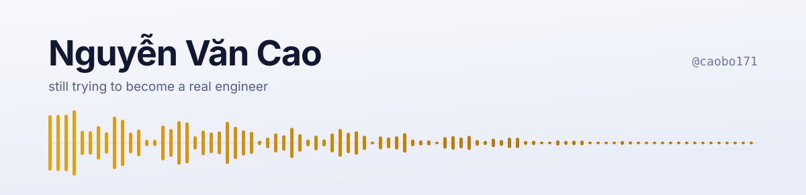
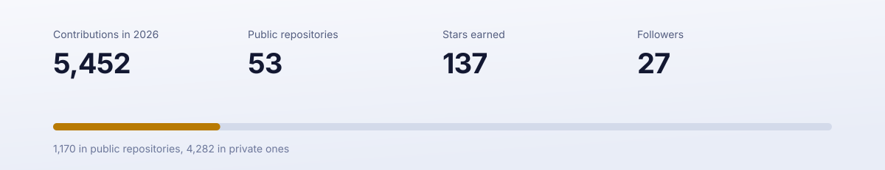

<picture>
  <source media="(prefers-color-scheme: dark)" srcset="assets/banner-dark.svg">
  <source media="(prefers-color-scheme: light)" srcset="assets/banner-light.svg">
  
</picture>

  
  
  

I'm a developer in Vietnam. I work at [Rework](https://rework.com), and most of the rest of my time goes into products I build myself — usually alone, usually late.

Nine years and fifty-odd repositories in, I still describe myself as someone trying to become a real engineer. That's the honest version.

## WELE

The one thing I can talk about openly.

WELE teaches English listening through dictation. You play real audio — podcasts, interviews, the news — type what you hear, and find out precisely which words your ear keeps missing. I built it for Vietnamese learners who couldn't pay for a course. It has been free for ten years, and it stays free.

- **10,000+** learners
- **200,000+** dictation submissions
- **10 years** online, free the entire time

  
  
  

## Everything else is still quiet

Four out of every five commits I make land in repositories nobody can see yet: research tooling, form automation, agent memory, a developer toolkit. None of it is ready to be talked about. When it is, it'll turn up here.

## Open source

[**node-zklib**](https://github.com/caobo171/node-zklib)  is the one that found an audience. It speaks the protocol of ZKTeco biometric attendance terminals — the fingerprint clocks bolted next to the door in factories and offices across Asia — so you can pull attendance records out of them from Node instead of their desktop software.

Also public:

- [easy-devtools](https://github.com/caobo171/easy-devtools) — the small tools I reach for every day, in one place
- [rework-mcp-server](https://github.com/caobo171/rework-mcp-server) — an MCP server that gives agents access to Rework
- [jqueryflow](https://github.com/caobo171/jqueryflow) — react-flow, rebuilt for codebases that still run jQuery
- [auto-transcript](https://github.com/caobo171/auto-transcript) — turn an audio file into a transcript

## What I build with

  
  
  
  
  
  
  
  
  
  

## Activity

<picture>
  <source media="(prefers-color-scheme: dark)" srcset="assets/stats-dark.svg">
  <source media="(prefers-color-scheme: light)" srcset="assets/stats-light.svg">
  
</picture>

Rendered from the GitHub API by [a script in this repository](scripts/render_stats.py) and refreshed every morning, rather than loaded from a third-party service that goes down.
